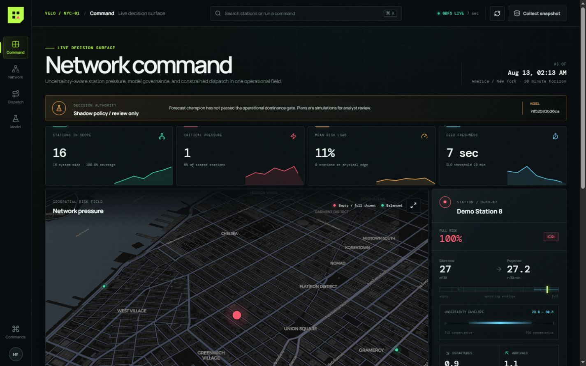
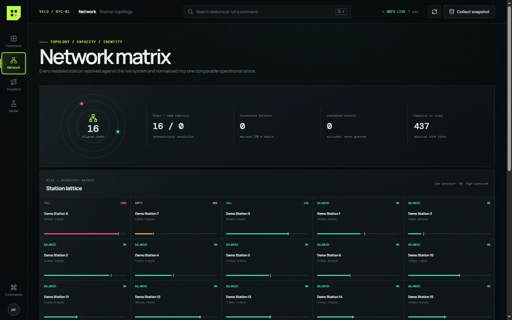
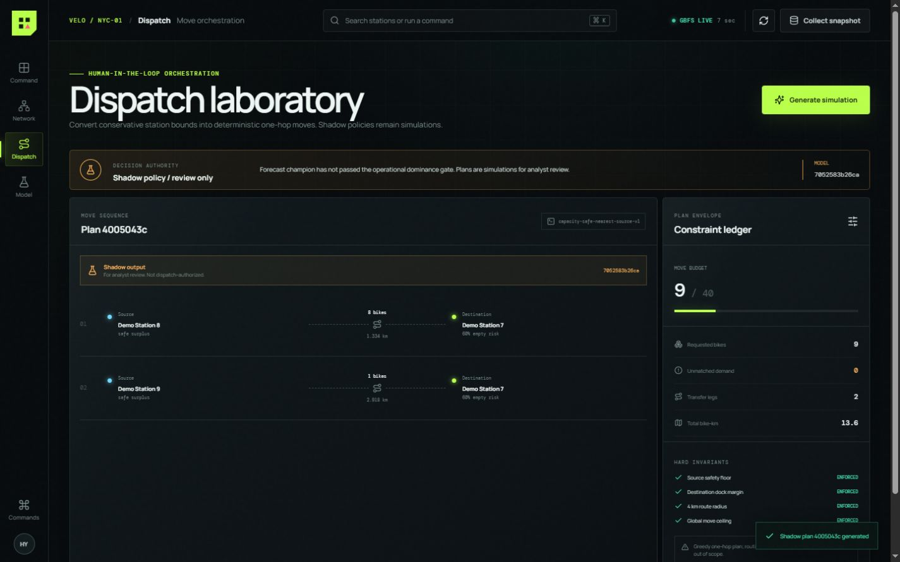
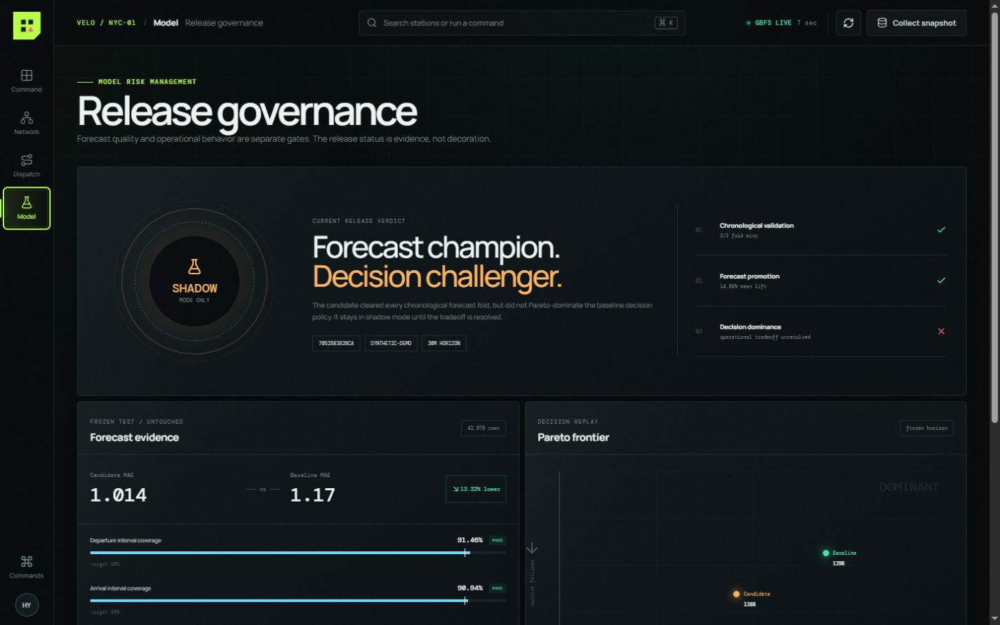
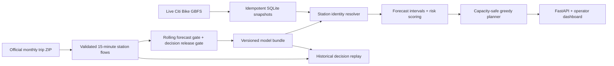

# VeloGuard

**Uncertainty-aware bike-share forecasting and rebalancing decision support.**

VeloGuard predicts station-level departures and arrivals for the next 30 minutes, turns forecast intervals into empty/full risk, then creates deterministic bike-transfer recommendations that respect inventory, dock capacity, distance, and fleet-move budgets.

This is deliberately a decision system, not only a notebook: immutable official-data ingestion, leakage-resistant evaluation, model promotion, live GBFS snapshots, station-identity reconciliation, idempotent plan APIs, a historical decision replay, and an operator dashboard all run from one small Python codebase.

## Why this project is different

- **Business objective before model metric:** the system measures simulated service failures and operational bike moves, not MAE alone.
- **Time-aware evaluation:** three rolling validation windows, a separate calibration window, and one untouched five-day test window.
- **Uncertainty enters the decision:** conservative forecast bounds determine whether a station needs bikes or has safe surplus.
- **Safe degradation:** stale live data is rejected by default; the dashboard may display it only with an explicit warning.
- **Station identity is treated as data engineering:** exact ID, unique normalized name with a distance guard, then a 150 m coordinate fallback.
- **Two-stage release gate:** forecast promotion requires ≥2% mean validation improvement and majority fold wins; decision release additionally requires Pareto improvement over the baseline replay.

## Operator console

### Command center

Live network pressure, freshness, uncertainty, and station-level evidence share one decision surface.



### Network topology

Identity resolution and capacity-normalized inventory expose coverage gaps before they become model errors.



### Dispatch simulation

Every proposed move remains visibly shadow-only and is accompanied by its hard capacity, distance, and budget invariants.



### Model governance

Forecast promotion and operational dominance are separate gates, with frozen-test evidence and the Pareto verdict kept visible.



## Verified result

One reproducible run used the complete January 2024 Citi Bike trip archive and the 40 busiest stations selected only from the first 60% of the month.

| Check | Result |
|---|---:|
| Valid trips processed | 1,881,977 |
| Aggregated 15-minute rows | 120,680 |
| Rolling validation wins | 3 / 3 |
| Mean rolling MAE improvement | 10.57% |
| Frozen-test combined MAE | 1.823 trips / station / horizon |
| Frozen-test improvement over baseline | 5.21% |
| Top-10% imbalance recall | 40.12% |
| Replay failures: no action | 4,280 |
| Replay failures: baseline policy | 1,557 (-63.62%) |
| Replay failures: candidate policy | 1,652 (-61.40%) |
| Candidate vs baseline policy | 95 more failures, 199 fewer bike moves → shadow mode |
| Live GBFS snapshot | 2,509 system stations; 39 model stations aligned |
| Warm risk API, local TestClient | p95 21.4 ms over 20 calls |

The candidate is the **forecast champion** but remains `shadow_mode_only`: its decision replay traded 95 extra failures for 199 fewer moves and therefore did not dominate the baseline. This result is intentionally not hidden. The replay is controlled simulation, not a causal estimate of real operations; assumptions and the uncertainty-coverage shortfall are documented in [Model card](docs/model-card.md).

The concise machine-readable evidence is preserved in [Verified run](docs/verified-run.json).

## Architecture



The detailed requirements, invariants, APIs, failure modes, and evolution path are in [System design](docs/system-design.md). The operator-console research, interaction model, visual system, and responsive rules are in [Frontend design](docs/frontend-design.md).

## Quick start: offline demo

The demo creates synthetic station flows, trains both models, seeds a snapshot, and requires no network.

```powershell
# Windows PowerShell
py -3.12 -m venv .venv
.\.venv\Scripts\Activate.ps1
python -m pip install -r requirements.txt
veloguard demo
veloguard serve
```

```bash
# Linux / WSL
python3 -m venv .venv
source .venv/bin/activate
python -m pip install -r requirements.txt
veloguard demo
veloguard serve
```

Open `http://127.0.0.1:8000`. The API contract is available at `http://127.0.0.1:8000/docs`.

The production frontend is already built into `web/`. To change it, use the checked-in React/TypeScript source:

```powershell
# Windows PowerShell
cd frontend
pnpm install
pnpm build
cd ..
veloguard serve
```

```bash
# Linux / WSL
cd frontend
pnpm install
pnpm build
cd ..
veloguard serve
```

## Reproduce the official-data pipeline

The configured run downloads about 369 MB from Citi Bike, aggregates the top 40 stations, trains/evaluates the model, and collects one live GBFS snapshot.

```powershell
# Windows PowerShell
veloguard pipeline
veloguard serve
```

```bash
# Linux / WSL
veloguard pipeline
veloguard serve
```

For a faster ingestion smoke test, use `veloguard pipeline --max-rows 250000`. Do not compare its metric to the verified full-month result.

Data sources: [Citi Bike system data](https://citibikenyc.com/system-data), [GBFS v2.3 discovery feed](https://gbfs.citibikenyc.com/gbfs/2.3/gbfs.json), and the [GBFS reference specification](https://gbfs.org/documentation/reference/).

## CLI

| Command | Purpose |
|---|---|
| `veloguard backfill` | Download immutable trip archives and build the station-flow table |
| `veloguard train` | Run backtests, promotion, calibration, frozen test, and decision replay |
| `veloguard collect` | Store one live GBFS snapshot in SQLite |
| `veloguard demo` | Build a complete offline synthetic demonstration |
| `veloguard pipeline` | Run official backfill, train, and live collection |
| `veloguard serve` | Serve the API and dashboard |

All paths and decision limits are in `config/default.json`. Secrets are not required.

## API contract

| Method | Endpoint | Behavior |
|---|---|---|
| `GET` | `/healthz` | Readiness plus degraded status when the feed is stale |
| `POST` | `/v1/snapshots/collect` | Discover, validate, and idempotently store current GBFS data |
| `GET` | `/v1/stations/risks` | Return scoped 30-minute risks; stale data is denied by default |
| `GET` | `/v1/model/summary` | Return curated release, forecast, calibration, and replay evidence |
| `POST` | `/v1/rebalance-plans` | Create a deterministic plan; requires `Idempotency-Key` |
| `GET` | `/v1/rebalance-plans/{plan_id}` | Retrieve an immutable plan |

Example:

```bash
# Linux / WSL
curl -X POST http://127.0.0.1:8000/v1/snapshots/collect
curl http://127.0.0.1:8000/v1/stations/risks
curl -X POST "http://127.0.0.1:8000/v1/rebalance-plans" \
  -H "Content-Type: application/json" \
  -H "Idempotency-Key: interview-demo-001" \
  -d '{"max_total_moves": 20}'
```

## Test

```powershell
# Windows PowerShell
python -m pytest -q
python -m compileall src
cd frontend
pnpm build
```

```bash
# Linux / WSL
python -m pytest -q
python -m compileall src
cd frontend
pnpm build
```

The suite verifies future-horizon construction and chronological splits, station reconciliation, planner safety/idempotency, and the complete model → snapshot → API → plan path.

## Repository map

```text
veloguard/
├── config/default.json       # Data, evaluation, feed, and planning limits
├── docs/                     # System, model, frontend, and interview evidence
├── frontend/                 # React/TypeScript operator-console source
├── src/veloguard/
│   ├── data.py               # Official ingestion, validation, aggregation
│   ├── features.py           # Point-in-time features and rolling splits
│   ├── train.py              # Baseline, candidate, promotion, calibration
│   ├── replay.py             # Historical decision simulator
│   ├── live.py               # GBFS discovery and SQLite persistence
│   ├── forecast.py           # Identity alignment, prediction, risk scoring
│   ├── planner.py            # Constraint-aware transfer recommendations
│   ├── api.py                # FastAPI boundary and cache invalidation
│   └── __main__.py           # CLI
├── tests/test_core.py
└── web/                      # Production frontend build served by FastAPI
```

## Intentional limits

- The portfolio model covers 40 high-activity stations, not the full network. Live coverage was 39 of 2,509 stations in the verified snapshot.
- The candidate forecast is shadow-only because the frozen decision replay found an unresolved failure-versus-effort tradeoff.
- The planner is a deterministic nearest-source heuristic, not a vehicle-routing optimizer.
- Weather, events, traffic, truck capacity, route time, and operator feedback are not modeled.
- SQLite is appropriate for a single-node MVP; a production multi-worker deployment needs a shared transactional store.
- There is no authentication or write-rate limiting; deploy only behind an authenticated gateway.

These limits are explicit so the system can be defended honestly in an interview and evolved based on measured need.
