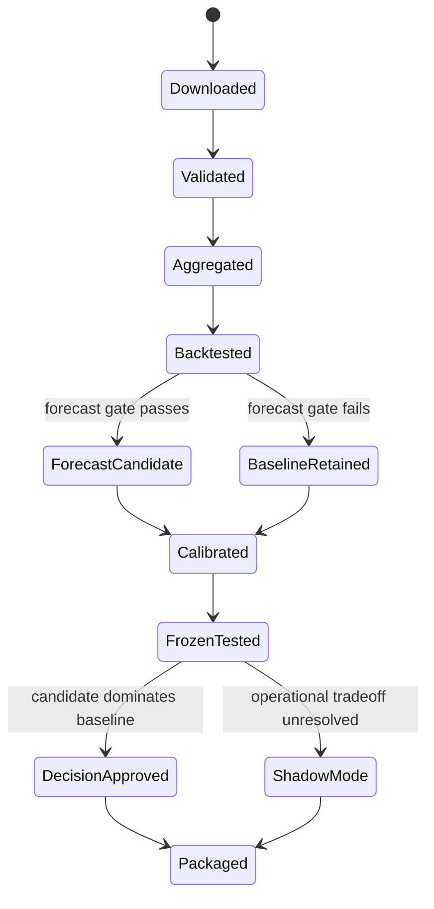
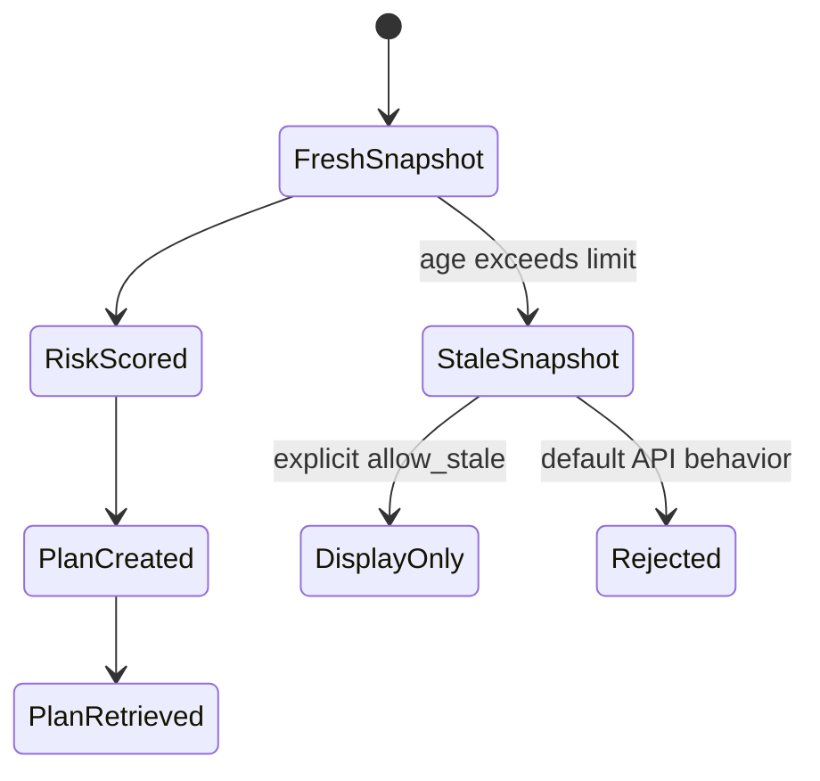
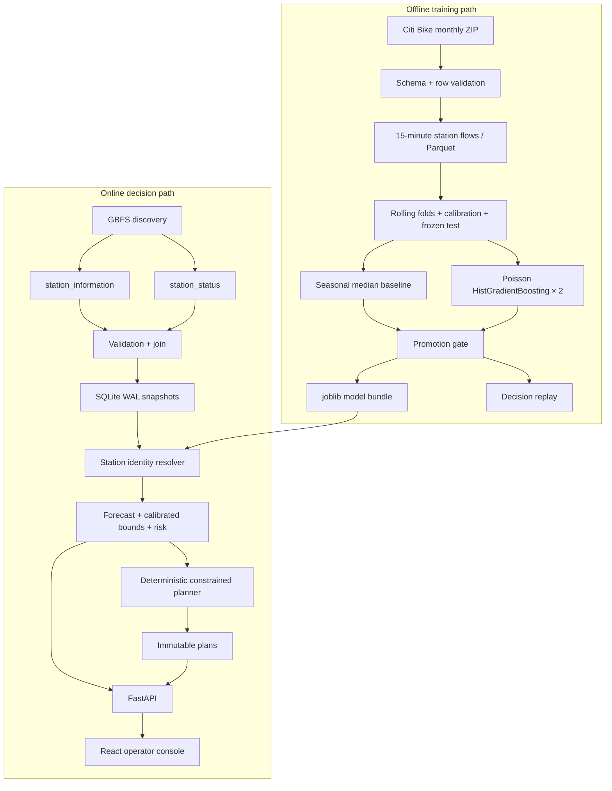

# VeloGuard System Design

## 1. Problem and product requirements

Bike-share operators lose service when riders find an empty station or cannot return a bike to a full station. The operational question is not merely “how many rides will happen?” It is:

> Given the latest station inventory and the next 30 minutes of uncertain demand, which limited bike moves reduce the most near-term service risk without creating a new shortage?

### Primary users

- Dispatch operator: sees current risk and generates a bounded action plan.
- ML engineer: trains, evaluates, promotes, and diagnoses the model.
- Data/platform engineer: operates ingestion, storage, freshness, and API health.

### MVP functional requirements

1. Convert official trip archives to station-level departure/arrival counts every 15 minutes.
2. Forecast the next 30 minutes for each modeled station.
3. Produce uncertainty bounds and empty/full risk, not a point estimate alone.
4. Collect the live GBFS station feed and refuse silent use of stale data.
5. Reconcile changing live station IDs to the historical model catalog.
6. Generate uncertainty-, capacity-, inventory-, distance-, and budget-safe transfer recommendations.
7. Evaluate both forecasting quality and simulated operational decisions; keep non-dominating candidates in shadow mode.
8. Expose the result through an API and usable operator console.

### Non-functional requirements

- Reproducibility: fixed seed, immutable source checksum, versioned artifact, explicit time windows.
- Safety: no transfer may exceed source surplus, destination capacity, route limit, or global move budget.
- Reliability: collection and planning are idempotent; feed age is visible and enforced.
- Latency: warm scoped-risk requests target p95 below 250 ms on one local process.
- Explainability: every risk exposes type, score, interval-derived projection, timestamp, and model version.
- Portability: Python 3.11+, no secrets, one JSON config, offline demo path.

### Out of scope for MVP

- Automatic dispatch or changing real Citi Bike operations.
- Multi-truck vehicle routing, traffic, loading time, labor scheduling, or depot replenishment.
- Full-network production modeling, weather/event enrichment, streaming infrastructure, and autoscaling.
- Claiming replay results as causal real-world impact.

## 2. Scale estimate and consequences

The verified live feed contained 2,509 stations. At 15-minute cadence, a full network yields about 240,864 station snapshots/day (`2,509 × 96`). A year is about 88 million rows before replication and features.

The MVP deliberately scopes training to 40 high-activity stations: 3,840 rows/day and about 1.4 million rows/year. January 2024 produced 120,680 aggregated rows. This fits comfortably in Parquet, memory, and a single-process histogram gradient booster.

Consequences:

- Batch training is simpler and cheaper than a streaming feature platform at this scale.
- SQLite handles the single-process demo, but multiple API workers would require PostgreSQL or another shared transactional database.
- The feature and prediction interfaces remain tabular so the storage and model implementations can evolve independently.

## 3. Data structures and invariants

### Core entities

| Entity | Primary identity | Important fields |
|---|---|---|
| `StationFlow` | `(station_id, timestamp)` | departures, arrivals, name, coordinate |
| `ModelBundle` | `model_version` | champion, models, station catalog, calibration errors, time metadata |
| `StationSnapshot` | `(observed_at, station_id)` | bikes, docks, capacity, operating flags, source timestamp |
| `StationRisk` | `(observed_at, live_station_id, model_version)` | forecast bounds, projected inventory, risk type/score |
| `RebalancePlan` | `plan_id` and idempotency key | snapshot, model version, moves, unmatched demand, limitations |

### Invariants

- Training labels are sums strictly after feature time: `t+15` and `t+30`, never current-bucket outcomes.
- Train end `<` validation start and calibration end `<` frozen-test start.
- Station selection is based only on the first 60% of the available month.
- A live station maps to at most one model station, and a model station maps at most once per snapshot.
- A normalized-name match is allowed only within 500 m; coordinate fallback is limited to 150 m.
- `0 ≤ source_after`, `destination_after ≤ capacity - safety_docks`.
- Sum of plan moves is no greater than `max_total_moves`; every route is no longer than `max_route_km`.
- Model cache invalidates on artifact modification; risk cache invalidates on snapshot timestamp.
- Stale data is rejected unless the caller opts in; the UI labels opt-in stale data visibly.

### State transitions





## 4. Data and serving architecture



### Why this architecture

- It separates historical learning from live inventory state: trip archives are append-only facts; snapshots are mutable in time but immutable per observation.
- It keeps failure domains visible. A GBFS outage does not destroy the last snapshot; a stale snapshot cannot silently create a plan.
- The model artifact contains its station catalog and calibration values, so the online service does not need a second feature registry for the MVP.
- The linear code path is easy to inspect. Heavy orchestration, queues, a feature store, and Kubernetes are deferred until real load or organizational boundaries justify them.

### Operator-console boundary

The console is a separately built React/TypeScript application served as static assets by FastAPI. It consumes only four curated surfaces: health/freshness, station risks, model evidence, and immutable plan creation. UI state (view, selected station, filters, command palette, and the current simulation) remains local; authoritative risk, release, and plan state always comes from the API.

The map renderer is isolated behind a station-array input, tables retain native HTML semantics, and charts are small SVG projections of existing response data. This keeps the decision surface rich without introducing a client state framework, chart framework, or component suite. See [Frontend design](frontend-design.md) for the research and interaction decisions.

## 5. ML design

### Target

For station `s` at 15-minute bucket `t`:

- departure target = departures at `t+15` plus `t+30`;
- arrival target = arrivals at `t+15` plus `t+30`.

Separate non-negative count models make the downstream inventory equation explicit:

`projected_bikes = current_bikes + predicted_arrivals - predicted_departures`.

### Features

- station identity;
- day of week and 15-minute bucket of day;
- hour, minute, weekend flag;
- sine/cosine encodings for time of day and day of week.

These are known at inference time. The MVP intentionally excludes weather and events to avoid an unverified external dependency.

### Models

- Baseline: median by station × day of week × time bucket, with station/bucket, bucket, and global fallbacks.
- Candidate: one `HistGradientBoostingRegressor(loss="poisson")` for departures and one for arrivals; ordinal encoding handles unseen categories.

Forecast promotion requires mean rolling MAE improvement ≥2% and wins in a majority of folds. The untouched frozen test is then a release gate, not a tuning set: a candidate is approved for decision support only when it is no worse than baseline on both replay service failures and bike moves, and strictly better on at least one. Otherwise the artifact is labeled `shadow_mode_only`.

### Uncertainty

The system fits the selected model before a distinct calibration window, then uses a finite-sample “higher” quantile of absolute calibration residuals. These symmetric residual bands are operationally useful but the verified frozen-test coverage was 88.72%/87.70% against a 90% target. Production evolution should use station/volume-conditional conformal calibration and monitor coverage by time and station segment.

## 6. Planner design

Each station becomes one of two constrained quantities:

- **Need:** bikes required to reach the target fill level from the conservative lower inventory bound, capped so the upper bound plus added bikes preserves the dock margin.
- **Surplus:** bikes safe to remove while both current inventory and the conservative lower future bound stay above their safety/target floors.

The planner sorts destinations by highest empty risk and sources by nearest distance, then greedily transfers the smallest of remaining need, safe surplus, and global budget.

Why greedy for MVP:

- deterministic, fast, and explainable;
- all safety invariants can be checked locally;
- appropriate while truck routes, shift boundaries, and service-level costs are unknown.

Evolution trigger: replace the heuristic with min-cost flow or a vehicle-routing optimizer only when real constraints and an agreed cost function exist. Preserve the same planner input/output contract.

## 7. API design

### `GET /healthz`

Response `200` always describes process health. `status="degraded"` means the model/snapshot is missing or feed age exceeds the limit.

### `POST /v1/snapshots/collect`

- Request body: none.
- Success: source timestamp, observation timestamp, station count, feed age.
- `502`: discovery, network, schema, or persistence failure.
- Idempotency: snapshot primary key prevents duplicate station rows for the same observation.

### `GET /v1/stations/risks?limit=200&allow_stale=false`

- `limit`: 1–3,000.
- `allow_stale`: explicit diagnostic/display override.
- Success: model metadata, system/model coverage, alignment method counts, and ranked station risks.
- `503`: missing model/snapshot, stale snapshot without override, or no aligned model stations.

### `POST /v1/rebalance-plans?allow_stale=false`

Required header: `Idempotency-Key` of 8–128 characters.

```json
{"max_total_moves": 20}
```

- `max_total_moves`: optional, 0–500; overrides only the request budget.
- Success: deterministic plan ID, moves, bike-km, unmatched need, and limitations.
- Repeating the same idempotency key returns the stored immutable plan.
- `422`: validation error; `503`: model/snapshot/freshness failure.

### `GET /v1/rebalance-plans/{plan_id}`

- `200`: stored plan.
- `404`: unknown plan.

Authentication is outside this MVP. In production, collection and plan creation must be behind an authenticated gateway with operator roles and audit logging.

## 8. Storage and consistency

### Immutable raw files and Parquet

Downloads are written to `.part`, atomically renamed, verified as ZIP, and recorded with SHA-256. Parquet is the compact training interface.

### SQLite

SQLite uses WAL mode and primary keys for snapshot and plan idempotency. Transactions are local and adequate for one process.

Production evolution:

- object storage + catalog for raw and curated history;
- warehouse/lakehouse for training features;
- PostgreSQL for live snapshots, plans, idempotency keys, and audit history;
- a queue only if collection or planning must be decoupled for throughput/retry isolation.

## 9. Reliability, observability, and security

### Failure behavior

| Failure | Behavior |
|---|---|
| GBFS unavailable or malformed | Collection returns `502`; last snapshot remains intact |
| Feed older than 600 s | Health degrades; decision APIs return `503` by default |
| Artifact missing/corrupt | Risk/plan APIs return `503`; health shows model not ready |
| Station ID changed | Guarded name/coordinate reconciliation; unmatched stations excluded |
| No safe source or route | Partial/empty plan with explicit unmatched bike count |
| Duplicate plan request | Stored plan returned by idempotency key |

### Minimum production telemetry

- Feed: collection success rate, source age, station count, schema violations.
- Model: MAE, interval coverage, top-risk recall, drift by station/time segment.
- Decision: requested/moved/unmatched bikes, bike-km, constraints binding, operator acceptance.
- API: rate, error rate, cold/warm latency, cache hit rate.
- Audit: snapshot timestamp, model version, config hash, idempotency key, plan and operator.

### Security boundary

- No credentials are committed or required.
- Inputs have Pydantic bounds and prepared SQL parameters.
- HTML escapes live station names before injecting markup.
- Production needs TLS, authentication/authorization, write rate limits, dependency scanning, CSP, and network egress controls.

## 10. Verified results and honest interpretation

- Official January 2024: 1,881,977 valid trips, 120,680 aggregated rows, 40 stations.
- Candidate won 3/3 rolling folds, mean 10.57% forecast improvement.
- Frozen test: 1.823 combined MAE, 5.21% improvement over baseline, 40.12% top-decile imbalance recall.
- Uncertainty-aware replay: 4,280 no-action failures, 1,557 with baseline decisions, and 1,652 with candidate decisions. Candidate used 199 fewer bike moves but incurred 95 more failures, so it did not dominate and is `shadow_mode_only`.
- Live snapshot: 39 historical stations aligned among 2,509 system stations (32 name, 7 coordinate in the first verified collection).
- Warm local risk API: p95 21.4 ms over 20 TestClient requests; cold model load was about 3.07 s.

These measurements demonstrate the code path and expose a forecast/decision tradeoff. They do not establish production SLOs or real-world causal impact.

## 11. Main risks and evolution plan

1. **Small history and distribution shift.** Add several seasons, holidays, weather, event features, and periodic recalibration only after proving data quality.
2. **Low live network coverage.** Expand station scope and retrain; expose coverage as an SLO. Never score unknown stations with false confidence.
3. **Station identity drift.** Build a reviewed canonical-station registry with effective dates; quarantine ambiguous mappings.
4. **Under-covered intervals.** Use conditional conformal calibration, evaluate station/volume groups, and widen decisions when coverage degrades.
5. **Simplified simulator and unresolved release gate.** Replay actual capacity history and inventory, define stakeholder-approved cost/constraint priorities, then run a prospective shadow test before any dispatch experiment.
6. **Greedy routing.** Learn operational costs and constraints, then compare min-cost flow/VRP against the heuristic on decision metrics.
7. **Single-node persistence.** Move state and idempotency to PostgreSQL before adding workers.

## 12. Definition of done for a production pilot

- Three months of shadow-mode predictions with frozen, versioned inputs.
- Coverage and error budgets agreed by station/time segment.
- Identity mapping review and full audit lineage.
- Route/truck constraints encoded and validated with operators.
- Human approval remains in the loop.
- Candidate exits shadow mode only after a prospective gate approved by operations.
- Prospective A/B or stepped-wedge evaluation reviewed for causal validity.
